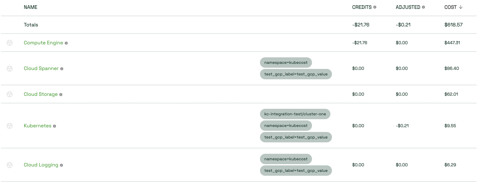

# \[GCP] Kubecost Asset Audit

The first step of auditing Kubecost data is reconciling asset prices to cloud provider data. Before doing this step, we recommend completing a cloud provider integration for higher accuracy. [Learn more about why](https://github.com/kubecost/docs/blob/master/assets.md#cloud-cost-reconciliation)

Note: it’s recommended that you select a time window where Kubecost was collecting data.48 hours in the past, because cloud provider data can be delayed up to 2 days.

In order to get a breakdown of kubernetes costs in the GCP Billing console, [Detailed Billing](https://guide.kubecost.com/hc/en-us/articles/4407601816087-GCP-Out-of-Cluster#step-1-enable-billing-data-export) must be enabled.

**Step 1:** Visit Kubecost Assets page\
.png>)

**Step 2:** Target a specific day in date range. Do the same in the GCP billing console. In this example we use November 1st Aggregate by Service and be sure to include the appropriate filters, including the Project. Failure to filter appropriately in the GCP billing console and Kubecost will result in inaccurate price matching.

<figure><figcaption>
Kubecost 
</figcaption></figure>

Step 3: In the GCP billing console, apply the following. Group by service and ensure that the correct org and project are set:

\

<figure><figcaption>
GCP Billing Console
</figcaption></figure>

You'll notice that Cloud Spanner, Cloud SQL and SFTP Gateway pricing match. In order to understand and break down costs for Kubernetes Engine and Compute Engine, detailed billing must be enabled. The next step would be to drill down further in both Kubecost and GCP Billing console to match more items.
